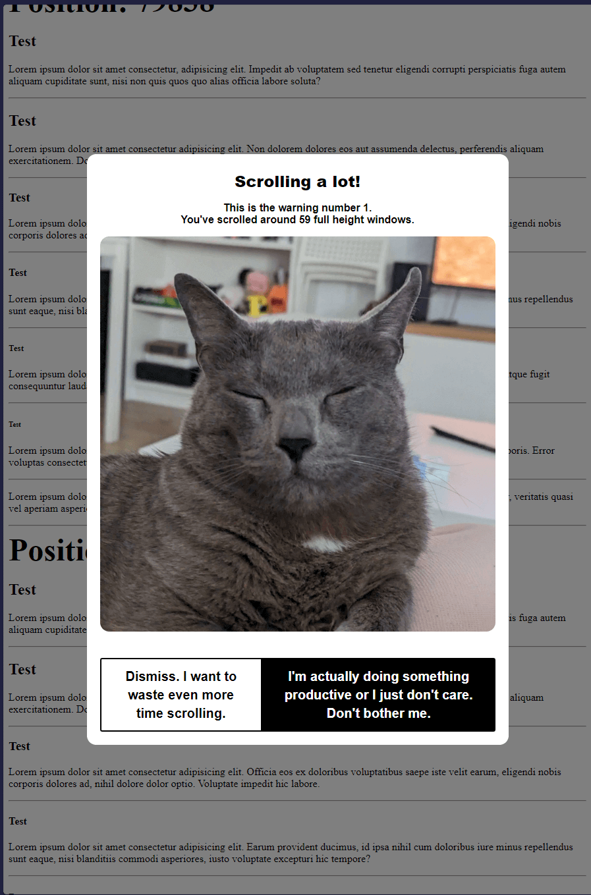

# Chrome Extension: Scroll Reminder

## Functionality

Chrome extensions that check how much you've scrolled down, and shows a pic of my cat with a reminder that you are probably wasting your time when you've scrolled a certain amount.

<!-- image -->

## Installation

1. Clone the repository.
2. Open Chrome and navigate to `chrome://extensions/`.
3. Enable "Developer mode" in the top right corner.
4. Click "Load unpacked" and select the directory containing the extension files.

## Usage

Once installed, the extension will automatically track your scroll distance on any website. When you reach the scroll limit, a modal will appear reminding you to take a break. Dismiss the modal to continue scrolling, and the scroll limit will increase for the next reminder.

## How It Was Built

This extension was built using a combination of manual coding and assistance from AI tools, specifically Aider and Cursor IDE. Below are some of the key steps and prompts used during the development process:

1. **Initial Setup and Scroll Tracking**:
    - The initial version of the extension tracked the number of scrolls and displayed a modal after a certain number of scrolls.
    - Prompt: "Change get_factorial() to use math.factorial"

2. **Switch to Scroll Distance**:
    - The extension was modified to track scroll distance instead of the number of scrolls.
    - Prompt: "Trigger a modal based on scroll distance traveled instead of the number of scrolls and increase the required distance each time the modal is dismissed."

3. **Adjusting Scroll Limits**:
    - The scroll limits were adjusted to better suit the intent of reminding users not to mindlessly scroll.
    - Prompt: "Adjust the distances and limits to reduce mindless scrolling on infinite scroll websites."

4. **Blocking Scrolling**:
    - Initially, the extension blocked scrolling when the modal was displayed, but this caused issues on some websites.
    - Prompt: "Block scrolling on the entire page when the modal is on the screen."

5. **Displaying an Image**:
    - The modal was enhanced to display an image from a specified URL.
    - Prompt: "Show an image from the URL `https://placecats.com/400/300` when the modal shows up."

6. **Enhancing Modal Appearance**:
    - The appearance of the modal was improved by setting text color, adjusting the layout for the image and button, and ensuring vertical alignment.
    - Prompt: "Make sure the text is visible by manually setting up the color, make the image appear below the text, and the button below the image, all center-aligned vertically."

7. **Final Adjustments**:
    - The extension was refined to ensure it only takes into account scrolling down and to prevent the page from jumping to the top when the modal is displayed.
    - Prompt: "Make it so the script only takes into account scrolling down."

## To do

- Add settings for user adjustments
- Create icon (tired/angry cat face)
- Publish as public extensions